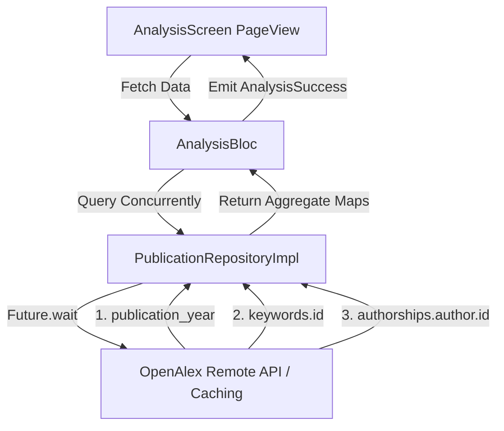

# Implementation Plan: Swipable Diagrams in Trend Analysis Screen

This document outlines the detailed design and implementation roadmap to add a swipable carousel interface for the Trend Analysis screen. The carousel will show three interactive diagrams sequentially (1, 3, and 7) based on the project requirements and OpenAlex API capabilities and availability.    

---

## 🎨 Diagram Definitions & OpenAlex API Mapping

Based on the spreadsheet interactive dashboard definitions:

1.  **Diagram 1: Publication Trend**
    *   **Description**: Number of papers per year over time.
    *   **Type**: Line Chart.
    *   **Endpoint**: `/works?filter=title_and_abstract.search:<keyword>&group_by=publication_year`
2.  **Diagram 3: Top Keywords**
    *   **Description**: Most frequent keywords associated with the searched topic.
    *   **Type**: Horizontal Bar Chart.
    *   **Endpoint**: `/works?filter=title_and_abstract.search:<keyword>&group_by=keywords.id`
3.  **Diagram 7: Author Impact**
    *   **Description**: Authors with the highest number of publications on this topic.
    *   **Type**: Horizontal Bar Chart.
    *   **Endpoint**: `/works?filter=title_and_abstract.search:<keyword>&group_by=authorships.author.id`

---

## 📱 User Interface & Interaction Design

### Mockup Prototype (`design/analysis.html`)
- **Structure**: We will encapsulate the charts in a carousel slider framework using standard HTML/CSS.
- **Header**: Display the Active Diagram Title (e.g., `Publication Trend`) and current topic (e.g., `Artificial Intelligence`) immediately below.
- **Controls**: Arrow indicators on the left and right, with dot indicators below.
- **Infinite Looping**: Implement CSS classes and simple Javascript animations so that sliding past Diagram 7 loops back to Diagram 1, and sliding back from Diagram 1 loops to Diagram 7.

### Flutter Screen (`analysis_screen.dart`)
- **Carousel Component**: We will utilize Flutter's native `PageView.builder` combined with a `PageController`.
- **Infinite Looping Implementation**:
  - Start the controller at a large initial page (e.g., `initialPage: 999`) to allow infinite swiping left and right from startup.
  - Resolve the current diagram index using `pageIndex = index % 3`.
- **Diagram Widgets**:
  - **Diagram 1**: Keep the premium `LineChart` (`fl_chart`) showing publication volumes.
  - **Diagram 3 & 7**: Implement custom-styled horizontal bar rows (glassmorphic containers, Cyan/Violet gradients, name labels on the left, count badges on the right). This ensures that long author names and keywords display legibly without clipping.

---

## ⚙️ API Caching & State Management Flow

1.  **OpenAPI Spec Updates**:
    - Update `docs/openapi.yaml` to document the `group_by=keywords.id` parameter.
    - Update `docs/openAPIAlex.md` to show example requests and responses for all three diagrams.
2.  **Clean Architecture Additions**:
    - Add `GetTopKeywords` usecase.
    - Update `AnalysisBloc` state to support `topKeywords` and `topAuthors` lists.
    - Query all three endpoints in parallel using `Future.wait` in `AnalysisBloc` for optimal loading.
